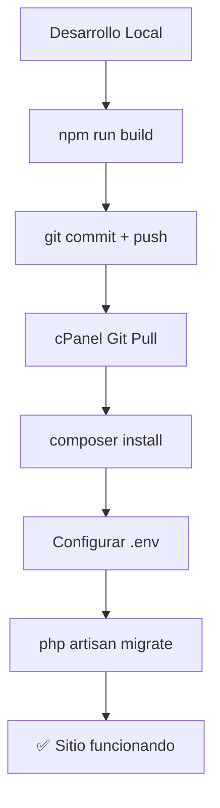

# 🚀 Soluciones para cPanel sin NPM

## 🤔 Problema
Tu servidor cPanel no tiene npm instalado, por lo que no puedes compilar assets de Laravel con Vite directamente en el servidor.

## ✅ Soluciones implementadas

### 🔄 Opción 1: GitHub Actions Automático (Recomendado)
**Archivo:** `.github/workflows/deploy-cpanel-no-npm.yml`

**Cómo funciona:**
1. Cada vez que hagas `git push` al repositorio
2. GitHub Actions automáticamente:
   - Compila los assets con npm
   - Instala dependencias de Composer
   - Crea un ZIP listo para cPanel
   - Lo sube como "artifact"

**Para usar:**
1. Haz push a tu repositorio
2. Ve a GitHub → Actions → Tu workflow
3. Descarga el artifact `emm-cpanel-deployment`
4. Sube el ZIP a cPanel y extrae en `/public_html/modelo-emm/`

### 🛠️ Opción 2: Script Local Manual
**Archivo:** `prepare-cpanel.sh`

**Cómo usarlo:**
```bash
# En tu máquina local:
./prepare-cpanel.sh
```

**Qué hace:**
- Compila assets localmente
- Excluye node_modules y archivos de desarrollo
- Crea un ZIP optimizado para cPanel
- Incluye instrucciones de instalación

### 📦 Opción 3: Commits con Assets Incluidos
**Modificación:** `.gitignore` actualizado

**Qué cambió:**
- Ahora los archivos de `public/build/` se incluyen en Git
- Puedes usar el Git™ Version Control de cPanel directamente
- Los assets compilados se mantienen en el repositorio

## 🎯 Método más simple (Recomendado)

**Para tu caso específico, te recomiendo:**

1. **Usar el Git de cPanel directamente:**
   ```bash
   # Ya compilaste los assets localmente
   git add .
   git commit -m "Include compiled assets for cPanel"
   git push origin main
   ```

2. **En cPanel:**
   - Ve a Git™ Version Control
   - Clona/actualiza desde tu repositorio
   - Los assets ya estarán compilados

## 🔧 Configuración inicial en cPanel

### 1. Clonar repositorio
```bash
# En cPanel File Manager o Terminal (si está disponible):
cd /public_html/modelo-emm
git clone https://github.com/AllenC2/emm-laravel.git .
```

### 2. Configurar Laravel
```bash
# Copiar y configurar .env
cp .env.production.example .env
# Editar .env con tus datos de base de datos

# Si tienes acceso a terminal:
composer install --no-dev --optimize-autoloader
php artisan key:generate
php artisan migrate --force
php artisan storage:link
```

### 3. Si no tienes terminal en cPanel
- Sube las dependencias de Composer pre-instaladas usando el script local
- Configura .env manualmente via File Manager
- Ejecuta migraciones via phpMyAdmin si es necesario

## 📁 Estructura esperada en cPanel

```
/public_html/
├── .htaccess (multi-dominio)
├── modelo-emm/
│   ├── public/
│   │   ├── .htaccess
│   │   ├── index.php
│   │   └── build/          # ✅ Assets compilados
│   │       └── assets/
│   │           ├── app-xxx.css
│   │           └── app-xxx.js
│   ├── app/
│   ├── vendor/            # ✅ Dependencias de Composer
│   ├── .env               # ⚙️ Tu configuración
│   └── ...
└── shalom-erp/ (tu otro proyecto)
```

## 🎨 Assets ya compilados

Los siguientes archivos ya están listos en `public/build/`:
- ✅ `app-C7eCAKQo.css` (228.10 kB → 31.30 kB gzipped)
- ✅ `app-CkIMDabS.js` (118.01 kB → 39.03 kB gzipped)
- ✅ `manifest.json`

## 🚨 Importante

1. **No ejecutes npm en cPanel** - Los assets ya están compilados
2. **Usa composer install** - Las dependencias PHP sí son necesarias
3. **Configura .env** - Especialmente la base de datos
4. **Verifica permisos** - storage/ y bootstrap/cache/ deben ser 755/777

## 🔄 Workflow recomendado



## 📞 Solución de problemas

### ❌ Error: "npm command not found"
**Solución:** Usa cualquiera de las 3 opciones arriba. No necesitas npm en cPanel.

### ❌ Assets no cargan
**Verificar:**
- Que `public/build/assets/` contenga archivos CSS/JS
- Que el .htaccess esté configurado correctamente
- Que no hay errores de permisos

### ❌ Error 500
**Verificar:**
- Permisos de `storage/` (755 o 777)
- Que `.env` esté configurado
- Que `APP_KEY` esté generada
- Logs en `storage/logs/laravel.log`

## 🎉 Resultado

Con cualquiera de estos métodos tendrás:
- ✅ Un sitio Laravel funcionando sin npm en cPanel
- ✅ Assets compilados y optimizados
- ✅ Workflow de desarrollo mantenible
- ✅ Despliegue automatizado (opcional)